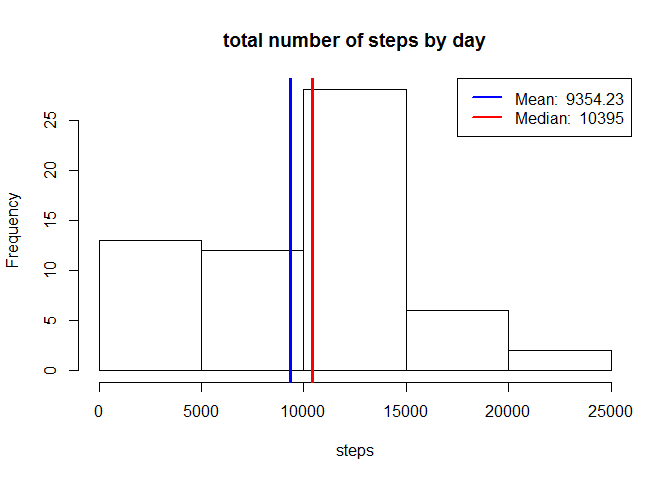
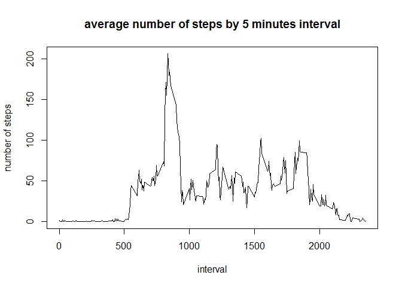
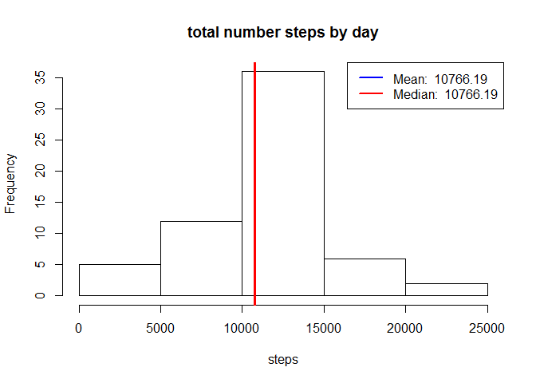

# test


## Loading and preprocessing the data 

If it's not available in the working directory, the data is downloaded from the URL stated in the project instructions and unzipped.

The data (.csv file) is read and the column _date_  is transformed to a more suitable format for later manipulation (Date).


```r
fileURL <-
    "https://d396qusza40orc.cloudfront.net/repdata%2Fdata%2Factivity.zip" 
destfile="repdata_data_activity.zip"    
  
if(!file.exists(destfile)) {
    download.file(fileURL ,destfile,method="auto") 
    unzip (destfile)}

unzipfile <- "activity.csv"
data <- read.csv(unzipfile)

data$date <- as.Date(as.character(data$date), "%Y-%m-%d")
```

Further discussion is based on the data downloaded on 24th Aug 2017.


## What is mean total number of steps taken per day?

The total number of steps per day is calculated and plotted in a histogram. 


```r
steps_by_day <- data %>% group_by(date) %>% summarize(totalsteps= sum(steps, na.rm = TRUE))
hist(steps_by_day$totalsteps, xlab= "steps", main  = "total number of steps by day")

mean_steps <- round(mean(steps_by_day$totalsteps),2)
median_steps <- round(median(steps_by_day$totalsteps),2)
zero_steps_days <- round(100*sum(steps_by_day$totalsteps == 0) / nrow(steps_by_day), 2)
abline(v=mean_steps, lwd = 3, col = 'blue')
abline(v=median_steps, lwd = 3, col = 'red')
legend('topright', lty = 1, lwd = 2, col = c("blue", "red"),
          legend = c(paste('Mean: ', mean_steps),
          paste('Median: ', median_steps))
        )
```

<!-- -->

```
## mean:  9354.23
```

```
## median:  10395
```

The mean is lower than the median, pointing to a left skewed distribution -it can be checked in the
histogram that there's a higher frequency in the lower range that includes 0 steps than in the upper ranges. In fact, there's a percentage of 13.11% days with 0 steps -one possible explanation would be that the owners didn't take the monitoring devices with them.


## What is the average daily activity pattern?

The average number of steps by 5-minute intervals is calculated and plotted. 


```r
steps_by_interval <- data %>% group_by(interval) %>% 
    summarize(meansteps= mean(steps, na.rm = TRUE))

with(steps_by_interval, plot(interval, meansteps, type="l", xlab= "interval", 
ylab = "number of steps", main  = "average number of steps by 5 minutes interval"))
```

<!-- -->

```r
max_interval <- steps_by_interval$interval[which.max(steps_by_interval$meansteps)]
max_steps_by_interval <- max(steps_by_interval$meansteps)
max_interval_hour <- as.character(max_interval)
max_interval_hour <- ifelse(nchar(max_interval_hour) ==3, paste("0", max_interval_hour, sep = ""), max_interval_hour)
max_interval_hour <- paste(substr(max_interval_hour,1,2), ":", substr(max_interval_hour,3,4),sep="")
```


```
##  interval with maximum average number of steps starts at:  08:35
```

```
##  number of steps in the interval:  206.1698
```

The interval with the highest mean number of steps ( 206.1698113) .
This is the 5 minutes interval that starts at  08:35.

## Imputing missing values

There's a number of missing values in the data read from the file. 


```r
total_missing <- sum(is.na(data$steps))
cat ("total missing values:", total_missing)
```

```
## total missing values: 2304
```

```r
cat ("percentage of missing values:", 100*total_missing/nrow(data),"%")
```

```
## percentage of missing values: 13.11475 %
```

A simple strategy is to fill the missing values with the average number of steps for the same interval, since we observe in the "average number of steps by 5 minutes interval" previously plotted a different pattern depending on the time of the day. 


```r
data2 <- merge(data, steps_by_interval)
data2$steps <- ifelse(is.na(data2$steps), data2$meansteps, data2$steps )
```

This modified data is plotted in a histogram and the mean and median are compared to the one of the
original dataset. 


```r
steps_by_day2 <- data2 %>% group_by(date) %>% summarize(totalsteps= sum(steps, na.rm = TRUE))
hist(steps_by_day2$totalsteps, xlab= "steps", main  = "total number steps by day")


mean_steps2 <- round(mean(steps_by_day2$totalsteps),2)
median_steps2 <- round(median(steps_by_day2$totalsteps),2)

abline(v=mean_steps2, lwd = 3, col = 'blue')
abline(v=median_steps2, lwd = 3, col = 'red')
legend('topright', lty = 1, lwd = 2, col = c("blue", "red"),
          legend = c(paste('Mean: ', mean_steps2),
          paste('Median: ', median_steps2))
        )
```

<!-- -->


```
## mean:  10766.19
```

```
## median:  10766.19
```

The plot shows a more  symmetric distribution than with the original dataset (in fact median = mean), 
and these values of mean and median are higher than in the original dataset (mean and median of 9354.23 and 1.0395\times 10^{4}). The frequency of the bracket around the mean increases and the frequency of the lowest values decreases.
## R Markdown

This is an R Markdown document. Markdown is a simple formatting syntax for authoring HTML, PDF, and MS Word documents. For more details on using R Markdown see <http://rmarkdown.rstudio.com>.

When you click the **Knit** button a document will be generated that includes both content as well as the output of any embedded R code chunks within the document. You can embed an R code chunk like this:


```r
summary(cars)
```

```
##      speed           dist       
##  Min.   : 4.0   Min.   :  2.00  
##  1st Qu.:12.0   1st Qu.: 26.00  
##  Median :15.0   Median : 36.00  
##  Mean   :15.4   Mean   : 42.98  
##  3rd Qu.:19.0   3rd Qu.: 56.00  
##  Max.   :25.0   Max.   :120.00
```

## Including Plots

You can also embed plots, for example:

<!-- -->

Note that the `echo = FALSE` parameter was added to the code chunk to prevent printing of the R code that generated the plot.
